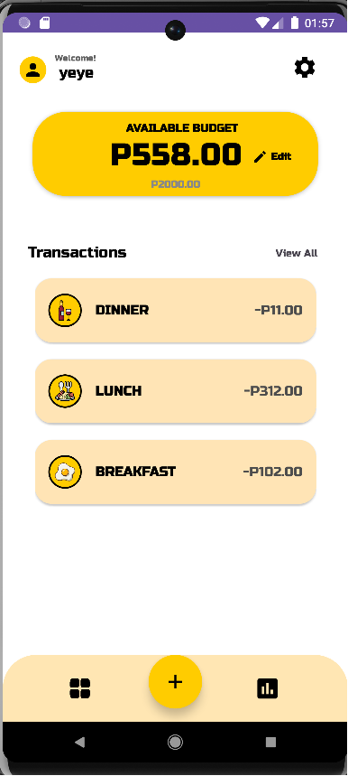
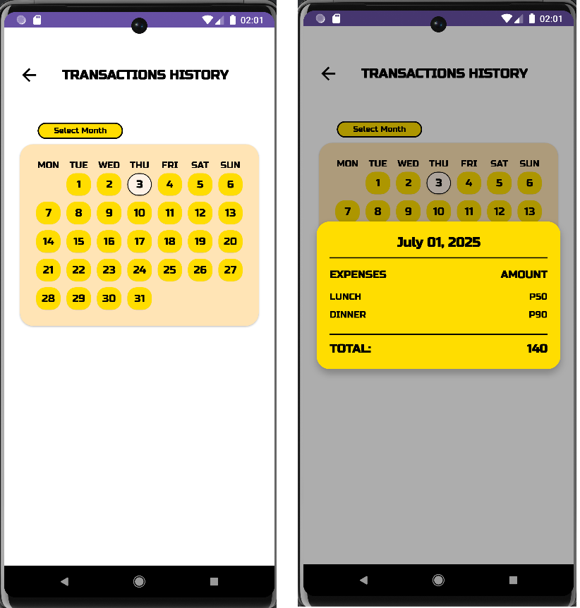
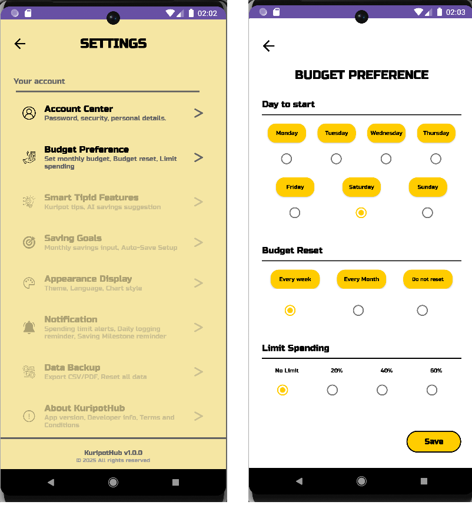

# KuripotHub

KuripotHub is a comprehensive personal finance management app designed to help users track their weekly expenses, manage budgets, and develop healthy spending habits. Whether you're looking to control your daily spending or build long-term financial discipline, this app offers an intuitive and feature-rich experience with real-time budget tracking, customizable preferences, and detailed expense analytics.

## Visual Demo

### Main Dashboard

*Main expense tracking interface with budget overview and category management*

### Transaction History

*Calendar-based transaction history with today's date highlighting*

### Settings & Preferences

*Comprehensive settings hub with preference management and future features*
## Features

- **Smart Budget Management**: Automatic weekly budget tracking with customizable reset periods
- **Real-time Expense Tracking**: Add expenses by category with instant budget updates
- **Calendar-based History**: Visual transaction history with today's date highlighting
- **Flexible Preferences**: Choose your week start day and spending limit percentages
- **Expense Summary Analytics**: Detailed weekly summaries with savings calculations
- **User Authentication**: Secure Firebase-based user management and data storage
- **Offline Functionality**: Local caching for seamless offline expense tracking
- **Modern UI/UX**: Clean Material Design interface with intuitive navigation

## Installation

```bash
# Clone the repository
git clone https://github.com/yourusername/KuripotHub.git
cd KuripotHub

# Open in Android Studio
# File > Open > Select KuripotHub folder

# Sync Gradle files
# Build > Clean Project
# Build > Rebuild Project

# Configure Firebase
# Add google-services.json to app/ directory
# Update Firebase configuration in build.gradle

# Run the application
# Click Run button or Ctrl+R
```

## Usage

### Budget Management
- **Set weekly budgets** with automatic period resets
- **Track remaining budget** in real-time as you add expenses
- **View savings** calculated as budget minus expenses
- **Color-coded indicators** for budget status (red when overspent)

### Expense Tracking
- **Add expenses by category** (Breakfast, Lunch, Dinner, etc.)
- **Real-time budget updates** with each transaction
- **Category management** to prevent duplicate daily entries
- **Weekly expense calculations** based on user preferences

### Transaction History
- **Calendar view** of all transactions with visual date highlighting
- **Day details** showing all expenses for selected dates
- **Monthly navigation** to browse historical data
- **Today's date highlighting** for easy current date identification

### Settings & Preferences
- **Week start customization** (Monday, Tuesday, etc.)
- **Spending limit settings** (20%, 40%, 60% of budget)
- **Account management** and preference storage
- **Future feature previews** (locked for upcoming versions)

## Built With

- 
- 
- 
- 
- 
- 
- 
- 

## Core Architecture

### Key Components
- **ExpenseTrackingActivity**: Main dashboard for budget and expense management
- **TransactionHistoryActivity**: Calendar-based expense history with date highlighting
- **ExpenseSummaryActivity**: Weekly analytics and savings calculations
- **SettingsActivity**: Preference management and future feature access
- **PreferenceActivity**: Budget and period customization
- **FirebaseManager**: Secure data storage and user authentication

### Smart Features
- **Automatic Budget Reset**: Weekly budget resets based on user's preferred start day
- **Period Detection**: Intelligent detection of new budget periods
- **Real-time Sync**: Instant data synchronization across app sessions
- **Offline Cache**: Local storage for seamless offline functionality
- **Category Intelligence**: Smart category tracking to prevent duplicate entries

## Acknowledgements

- **[Firebase](https://firebase.google.com/)**: For providing robust backend services and real-time database
- **[Android Material Components](https://material.io/develop/android)**: For modern UI components and design system
- **[Google Play Services](https://developers.google.com/android/guides/overview)**: For authentication and core Android functionality
- **[CardView & ConstraintLayout](https://developer.android.com/guide/topics/ui/layout)**: For flexible and responsive UI layouts
- **[Firestore](https://firebase.google.com/docs/firestore)**: For scalable NoSQL database and real-time synchronization
- **[Android Studio](https://developer.android.com/studio)**: For the comprehensive development environment
- **[Gradle](https://gradle.org/)**: For build automation and dependency management
- **[Calendar API](https://developer.android.com/reference/java/util/Calendar)**: For date and time calculations
- **[SharedPreferences](https://developer.android.com/reference/android/content/SharedPreferences)**: For local data persistence and user preferences
- **[Material Design Icons](https://fonts.google.com/icons)**: For consistent and accessible iconography
- **[Flaticon](https://www.flaticon.com/)**: For providing high-quality free icons and graphics
- **[Freepik](https://www.freepik.com/)**: For offering free vector icons and design resources

---

**KuripotHub v1.0.0**  
© 2025 All rights reserved

*Empowering users to take control of their financial future, one expense at a time.*